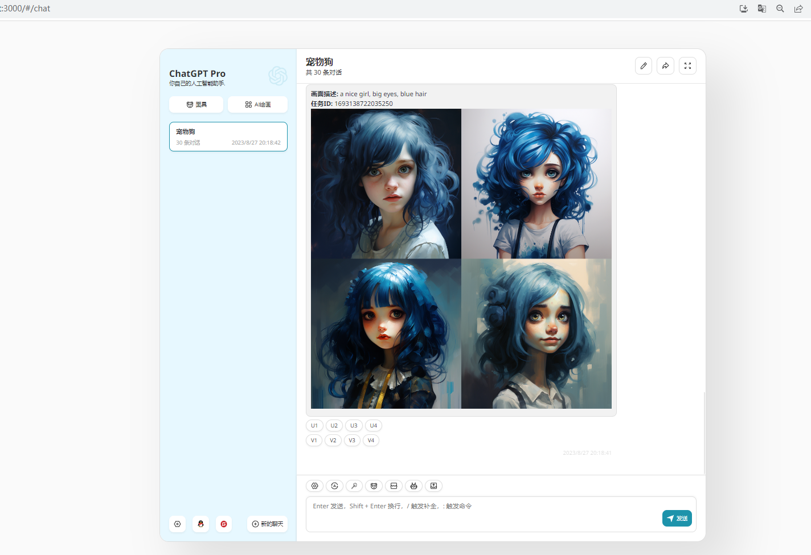
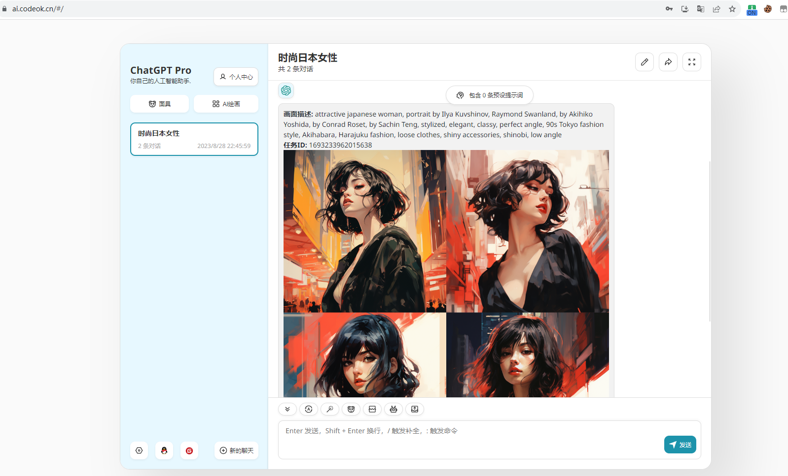

### 首先鄙视那些假开源的！！！各种套路，恶心人。求人不如求己，我准备自己动手，功能全部开源！！！

<div align="center">

<h1 align="center">🍭 ChatGPT-Pro</h1>

基于[ChatGPT-Next-Web](https://github.com/Yidadaa/ChatGPT-Next-Web) + [ChatGPT-Midjourney](https://github.com/Licoy/ChatGPT-Midjourney)开发，扩展了，注册、邮箱登陆、扫码登陆、会员管理、面具管理、SD绘画等功能

[QQ交流群](https://gitee.com/981743898/ChatGPT-PRO/issues/I7VUZB) | [💥演示站点](https://ai.codeok.cn)





### 成品展示



</div>

## 功能列表
- [x] 原`ChatGPT-Next-Web`所有功能
- [x] Midjourney `Imgine` 想象
- [x] Midjourney `Upscale` 放大
- [x] Midjourney `Variation` 变幻
- [x] Midjourney `Describe` 识图
- [x] Midjourney `Blend` 混图
- [x] Midjourney 垫图
- [x] 绘图进度百分比、实时图像显示
- [x] 注册
- [x] 邮箱登陆
- [ ] 扫码登陆
- [ ] 集成SD绘画
- [ ] 面具管理
- [ ] 会员管理
- [ ] 邀请码功能

## 参数说明
### MIDJOURNEY_PROXY_URL
```shell
MIDJOURNEY_PROXY_URL=http://yourip:port
```
> ⚠️注意：如果你使用的是Docker部署，那么这里的地址应该是`http://公网IP:port`，而不是`http://localhost:port`，因为Docker中的容器是隔离的，`localhost`指向的是容器内部的地址，而不是宿主机的地址。
- 界面中


### MIDJOURNEY_PROXY_API_SECRET
（可选）`midjourney-proxy`的API请求密钥，防止他人恶意调用，可在环境变量中配置。

### CODE
（可选）设置页面中的访问密码，防止被其他人轻易使用消耗余额


#### 手动部署
- clone本项目到本地
- 安装依赖
```shell
npm install
npm run build
npm run start // #或者开发模式启动： npm run dev
```
### midjourney-proxy 服务部署
#### Docker
- 运行 `midjourney-proxy` (Midjourney API服务，更多参数配置可以参考：[midjourney-proxy](https://github.com/novicezk/midjourney-proxy))
```shell
docker run -d --name midjourney-proxy \
 -p 8080:8080 \
 -e mj.discord.guild-id=xxx \
 -e mj.discord.channel-id=xxx \
 -e mj.discord.user-token=xxx \
 --restart=always \
 novicezk/midjourney-proxy:2.4
```
#### Railway
> Railway是一个提供弹性部署方案的平台，服务在海外，方便MidJourney的调用。

参考：[midjourney-proxy - Railway 部署教程](https://github.com/novicezk/midjourney-proxy/blob/main/docs/railway-start.md)

#### Zeabur 
> - 新注册的 Github 账号可能无法使用 Railway，但是能用 Zeabur 
> - 通过 Railway 部署的项目会自动生成一个域名，然而因为某些原因，形如 *.up.railway.app 的域名在国内无法访问
> - Zeabur 服务器运行在国外，但是其生成的域名 *.zeabur.app 没有被污染,国内可直接访问

[](https://dash.zeabur.com/templates/B04F4M)

参考：[midjourney-proxy - Zeabur 部署教程](https://github.com/novicezk/midjourney-proxy/blob/main/docs/zeabur-start.md)

## 使用
在输入框中以`/mj`开头输入您的绘画描述，即可进行创建绘画，例如：
```
/mj a dog
```
### 混图、识图、垫图

> 提示：垫图模式/识图(describe)模式只会使用第一张图片，混图(blend)模式会按顺序使用选中的两张图片（点击图片可以移除）

## 截图
### 混图、识图、垫图

### 状态实时获取

### 自定义midjourney参数

### 更多功能
- 等你自行发掘

## 鸣谢
- [ChatGPT-Next-Web](https://github.com/Yidadaa/ChatGPT-Next-Web)
- [midjourney-proxy](https://github.com/novicezk/midjourney-proxy)
- [ChatGPT-Midjourney](https://github.com/Licoy/ChatGPT-Midjourney)
## 开源协议
[Anti 996 LICENSE](./LICENSE)
